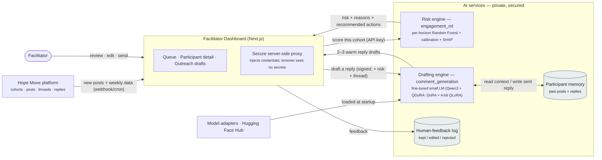

# Architecture diagram — generation prompt

Two ways to make the **full, correctly-connected** architecture diagram:

1. **Paste the prompt below** into your diagram generator (Eraser DiagramGPT, Napkin,
   Figma/FigJam AI, Whimsical AI, ChatGPT, etc.).
2. Or drop the **Mermaid** block at the bottom into any Mermaid renderer
   (mermaid.live, GitHub, Notion, VS Code) — no AI needed.

---

## Paste-ready prompt (tool-agnostic)

> Create a clean, professional **system architecture diagram**, laid out
> **left-to-right**, for the "Hope Move" AI facilitator-assist system. Use
> rounded rectangles, labelled arrows, and a calm palette (slate-blue accent
> `#356A86`, dark slate text `#1B2733`, warm off-white background `#FBFAF7`).
> Group the two AI services together and label the group "AI services
> (private, secured)".
>
> **Nodes:**
> - **Hope Move platform** — the source of truth. Holds cohorts, participants,
>   activity posts, discussion threads, and facilitator replies.
> - **Facilitator Dashboard** — a Next.js web app; the only interface
>   facilitators use. Has a **secure server-side proxy** that injects all
>   credentials, so the browser never sees secrets. Show its three panels as a
>   sub-label: "queue · participant detail · outreach drafts".
> - **Risk engine (engagement_ml)** — predicts weekly dropout risk per
>   participant: per-horizon Random Forest + probability calibration + SHAP
>   explanations. Outputs a risk level, the contributing factors, and
>   recommended actions.
> - **Drafting engine (comment_generation)** — a fine-tuned small language model
>   (Qwen3 family; **QDoRA** adapters — DoRA + 4-bit QLoRA) that writes
>   persona-conditioned warm reply drafts. Includes a **participant-memory
>   store** (past posts + facilitator replies) and a **human-feedback (HITL)
>   log**.
> - **Model adapters on Hugging Face Hub** — the QDoRA (DoRA + 4-bit QLoRA)
>   adapters the drafting engine loads.
> - **Hosting** — private Hugging Face Spaces and/or university HPC GPUs.
>
> **Connections (with labels):**
> - Hope Move platform → Facilitator Dashboard: "new posts + weekly cohort data
>   (webhook / cron)".
> - Facilitator Dashboard → Risk engine: "score this cohort" (secured with an
>   API key). Risk engine → Dashboard: "risk + reasons + recommended actions".
> - Facilitator Dashboard → Drafting engine: "draft a reply to this post"
>   (signed request; includes the risk context and the discussion thread).
>   Drafting engine → Dashboard: "2–3 warm reply drafts".
> - Drafting engine ↔ Participant-memory store: "read past context / write the
>   sent reply".
> - Facilitator (a person icon) → Dashboard: "review, edit, send". Dashboard →
>   Drafting engine's HITL log: "feedback (kept / edited / rejected)".
> - Model adapters on Hugging Face Hub → Drafting engine: "loaded at startup".
>
> Add a small footnote: "Personal details are de-identified · the facilitator
> always reviews and sends · nothing is sent automatically." Keep it uncluttered
> and presentation-ready.

---

## Mermaid version (drop-in fallback)

> Footnote for the diagram: personal details are de-identified; the facilitator
> always reviews and sends; nothing is sent automatically.

---

### Want a simpler, facilitator-level version?

Use the **four-box** flow already on slide 4 of the deck:
`Hope platform → The dashboard (what you use) → { Risk engine: who needs attention + why · Drafting engine: suggested warm replies }`, with the note
"secure & private · nothing is sent without you." The detailed diagram above is
better for your supervisor / a technical audience.
