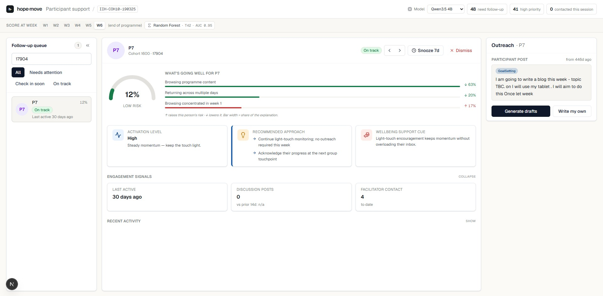

<!-- Backup / Q&A slides — not part of the main talk. Pull up only if needed,
     or just share the live dashboard in the browser. -->

## The dashboard at a glance

Three panels — <strong>who needs attention</strong> (left) · <strong>why</strong> (middle) · <strong>a ready-to-send reply</strong> (right).

