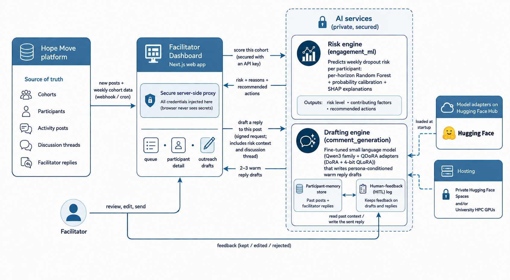

<!-- _class: lead -->

# AI Facilitator Assistant

Helping you support every participant on the Hope Programme — spot who needs you, and reply with warmth, faster.

People living with IIH 2025 · Participant-support dashboard

  
  
  

---

## Why we built this

- People living with long-term conditions can **quietly disengage** between sessions — and then drop out.
- No facilitator can watch **everyone, every week**.
- A short, warm, **well-timed** message early often makes the difference between someone staying or leaving.

The assistant helps you see who needs you this week — and reply sooner, in your voice.

---

## What it does

  

1 · Spot

Who needs attention

Every participant, ranked each week — and the plain-language reasons why.

  

2 · Support

A warm draft reply

A ready-to-send message in the programme's voice — you review, edit, and send.

It <strong>surfaces and suggests</strong>. You <strong>decide and send</strong>.

---

## How it fits together

  

Hope platform

cohorts · posts · replies

  
→

  

The dashboard

which you use

  
→

  

    

Risk engine

who needs attention + why

A prediction model that learns from past cohorts' weekly activity — it spots the early signs of someone slipping away, and shows the reasons.

    

Drafting engine

warm reply suggestions

A small AI language model, trained on real (anonymised) Hope facilitator replies — so its drafts sound like the programme.

  

Everything runs on secure, private systems · personal details are removed · nothing is sent without you.

---

## Each week: who needs attention — and why

- **The queue** ranks everyone by who needs attention — *Needs attention · Check in soon · On track*. The people most likely to slip sit at the top.
- **The why is clear**: a risk level, the main reasons (e.g. few visits, not posting, no contact yet), and a recommended approach + wellbeing cue for how to reach out.
- **A weekly rhythm**: the scores refresh each week — start at the top of the queue.

Week 1 matters most: a warm first contact early measurably lowers the chance someone drops out.

---

## Drafting the reply

- **Two or three warm tones** to choose from — pick what fits.
- **Edit, polish, and send** — always your words, your call.
- Someone **hasn't posted yet**? A "first check-in" gives you a warm opener so you can still reach out.

The draft is a starting point — never sent on its own.

---

## What's behind it

- The **draft replies** come from a small, fine-tuned **AI language model**, trained on real *(anonymised)* Hope facilitator replies — so it sounds like the programme, not a generic chatbot.
- The **risk score** comes from a **Random Forest** model — a well-established machine-learning method. It treats early drop-out as a **classification problem**: from each participant's weekly activity, how likely are they to disengage? Validated on past cohorts (about **0.94** accuracy).
- Both produce **suggestions only** — your judgement always leads.

---

<!-- _class: fig -->

## How it fits together — the full picture

The detailed view (for reference): the platform · the dashboard · the two AI services — with where data is kept and how it's secured.

